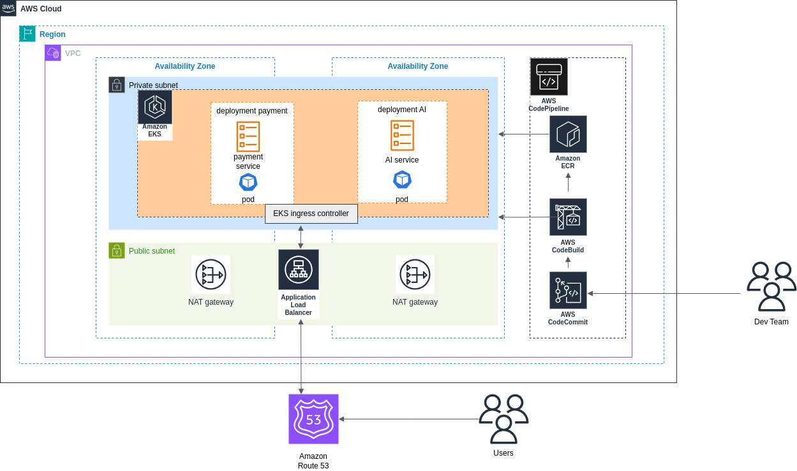

# EKS-Python-Deployment


### [View all Roadmaps](https://github.com/nholuongut/all-roadmaps) &nbsp;&middot;&nbsp; [Best Practices](https://github.com/nholuongut/all-roadmaps/blob/main/public/best-practices/) &nbsp;&middot;&nbsp; [Questions](https://www.linkedin.com/in/nholuong/)
<br/>

## system design architecture



scalable python solution deployment using EKS managed service.

### Cluster Setup

step 1. setup eks cluster

```bash
eksctl create cluster --name demo-cluster --region us-east-1 --fargate
```

step 2. update the kube config to work with eks cluster

```bash
aws eks update-kubeconfig --name bot-cluster --region us-east-1
```

step 3. create fargate profile to create namespace deployments

```bash
eksctl create fargateprofile \
    --cluster bot-cluster \
    --region us-east-1 \
    --name alb-python-app \
    --namespace game-2048
```

### Application Deployment

deploy the application

```bash
kubectl apply -f https://raw.githubusercontent.com/kubernetes-sigs/aws-load-balancer-controller/v2.5.4/docs/examples/2048/2048_full.yaml
```

### Permission Setup

configure IAM OIDC provider

```bash

eksctl utils associate-iam-oidc-provider --cluster bot-cluster --approve --region us-east-1
```

### Setup ALB addon

ALB controller is nothing but a kubernetes pod , so it has to create a application load balancer inside AWS , for that it need to communicate with AWS ALB service , which needs service role with permissions.

```bash
curl -O https://raw.githubusercontent.com/kubernetes-sigs/aws-load-balancer-controller/v2.5.4/docs/install/iam_policy.json
```

step 1. create IAM policy using the json file

```bash
aws iam create-policy \
    --policy-name AWSLoadBalancerControllerIAMPolicy \
    --policy-document file://iam_policy.json
```

step 2. create a service role with the policy attached

```bash
eksctl create iamserviceaccount \
  --cluster=bot-cluster \
  --region us-east-1 \
  --namespace=kube-system \
  --name=aws-load-balancer-controller \
  --role-name AmazonEKSLoadBalancerControllerRole \
  --attach-policy-arn=arn:aws:iam::630210676530:policy/AWSLoadBalancerControllerIAMPolicy \
  --approve
```

### Deploy ALB controller

step 1. add helm repo

```bash
helm repo add eks https://aws.github.io/eks-charts
```

step 2. update the helm repo

```bash
helm repo update eks
```

step 3. install aws-load-balancer controller

```bash
helm install aws-load-balancer-controller eks/aws-load-balancer-controller \
-n kube-system \
  --set clusterName=bot-cluster \
  --set serviceAccount.create=false \
  --set serviceAccount.name=aws-load-balancer-controller \
  --set region=us-east-1 \
  --set vpcId=vpc-0f6e5e88266ad0a7b
```

# 🚀  I'm are always open to your feedback.  Please contact as bellow information:
### [Contact ]
* [Name: nho Luong]
* [Skype](luongutnho_skype)
* [Github](https://github.com/nholuongut/)
* [Linkedin](https://www.linkedin.com/in/nholuong/)
* [Email Address](luongutnho@hotmail.com)


[](https://ko-fi.com/nholuong)

# License
* Nho Luong (c). All Rights Reserved.🌟
